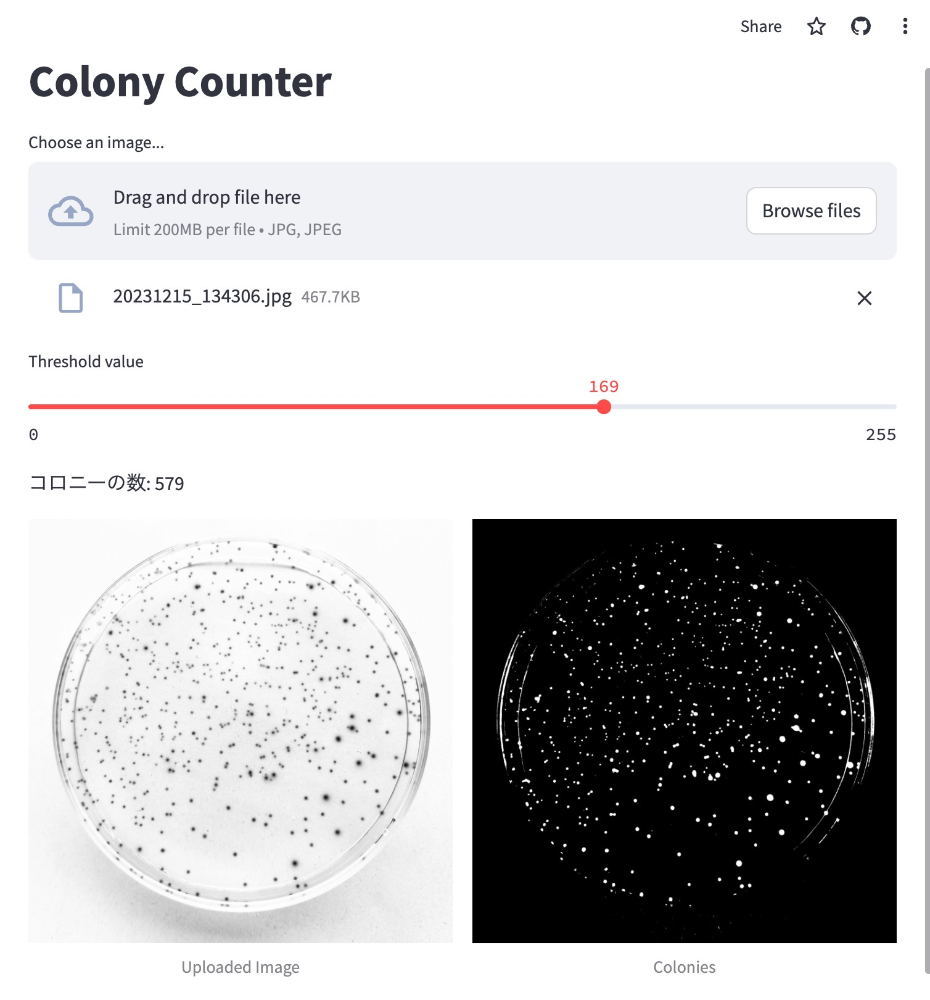

## Colony Counter
このプロジェクトは、アップロードされた画像からコロニーを検出し、その数をカウントするStreamlitアプリケーションです。
公開リンク:https://u-tokyo-ac-urban-students.streamlit.app/

## 必要なパッケージ
このプロジェクトを実行するには、以下のPythonパッケージが必要です。

- streamlit
- numpy
- opencv-python-headless
- Pillow
これらのパッケージは、以下のコマンドを使用してインストールできます。

```sh
pip install -r requirements.txt
```

## 実行方法
以下のコマンドを使用して、Streamlitアプリケーションを起動します。

```sh
streamlit run app.py
```

アプリケーションが起動したら、ブラウザで表示される指示に従って画像をアップロードし、閾値を調整します。その後、アプリケーションはアップロードされた画像からコロニーを検出し、その数をカウントします。

サンプル画像
以下は、このアプリケーションで使用できるサンプル画像です。


